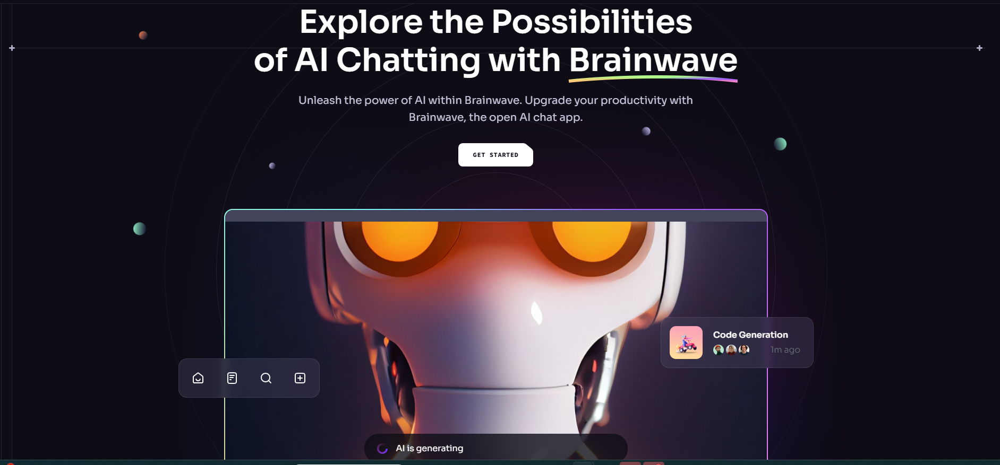

# Brainwave



## Description
Welcome to the Brainwave page! Here you will find the new way to use AI Chatting at a new level! You will be able to see the new features along with adding it to your life in the future. There are projects on the horizon!

## Table of Contents
 * [Description](#description)
 * [Installation](#installation)
 * [Usage](#usage)
 * [License](#license)
 * [Contributing](#contributing)
 * [Tests](#tests)
 * [Resources](#resources)

## Installation
You will need these npm (Node Package Manager) in order to view Apple. You will navigate to the root of the directory of the package.json file, navigate to "Open in Integrated Terminal" and enter these commands to install the packages:
```
npm install
npm install gsap

```


## Usage
You can use the "Node.js" terminal to check out Apple, and checkout information about what amazing new Apple products are up for sale.

## License
[](https://opensource.org/licenses/MIT)

## Contributing
All the contributions to this project is all done by Miles Wildmore.


## Tests

To test out Brainwave, you will need to run the server by typing this in the terminal and open the localhost from the root directory with this command: 
```
npm run dev

```

If you want to leave Brainwave in the terminal, hold "CTRL+C" ("CMD+C" for Mac) to stop hosting localhost.

## Resources

Link to the GSAP page: https://gsap.com/

Link to npm page : https://www.npmjs.com/

Link to get node.js: https://nodejs.org/